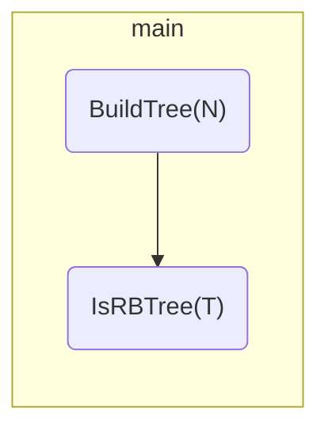
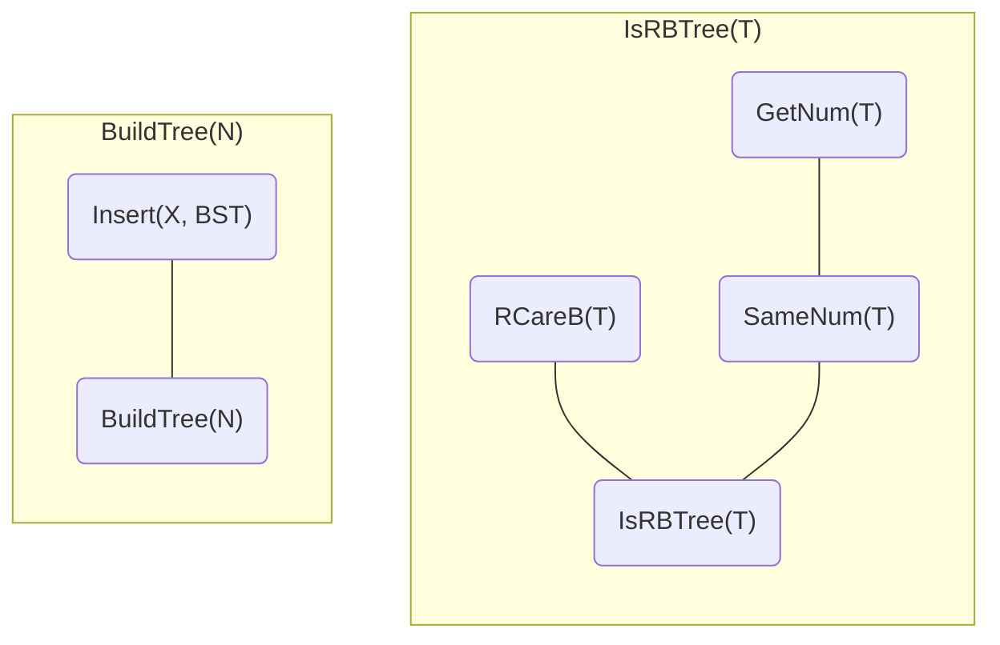

<h1 align = "center">ZJU-FDS-cx2020-Projects (Normal) <br/><br/>Is It A Red-Black Tree
</h1>


<h3 align = "center">3180103000 许乐乐
</h3>


<h6 align = "center">Date:2020-10-29
</h6>

<div style="page-break-after: always;"></div>


# 1. Introduction

In  computer science, red-black tree is a data structure used to associate array and store ordered data. It is a  kind of self balanced binary search tree. It was invented by Rudolf Bayer in 1972, also known as "symmetric binary B-tree". Its modern name was obtained in a paper written by Leo J. Guibas and Robert Sedgewick in 1978. It is complex, but its operation has good worst-case runtime and is efficient in practice. It can search, insert and delete in O (logN) time, where N is the number of nodes in the tree.

Both red-black tree and balanced binary tree (AVL tree) are variants of binary search tree, but the statistical performance of red-black tree is better than that of AVL tree. Because AVL trees are strictly balanced, red- black trees are black balanced. Maintaining balance requires additional operations, which increases the time complexity of the data structure. Therefore, the red black tree can be regarded as a compromise between binary search tree and AVL tree. It does not need to spend too much time maintaining the nature of the data structure while maintaining the balance. 

Red and black trees are used in many places, such as:

* *STL, map and set* of C + + are implemented with red-black tree.

* The famous Linux process scheduler *completely fair scheduler* uses red-black tree to manage process control blocks.

* *Epoll* in the kernel implementation, using red-black tree to manage event blocks.

* *Nginx* uses red-black trees to manage timers.

* Java *Treemap* implementation.

Red-black tree has the following 5 properties:

1. Every node is either red or black.

2. The root is black.

3.  Every leaf (NULL) is black.  <!--Note: the leaf node here refers to the leaf node which is empty (NULL)!-->

4. If a node is red, then both its children are black.

5. For each node, all simple paths from the node to descendant leaves contain the same number of black nodes. <!--It ensures that no path is twice as long as the others. Therefore, red black trees are relatively close to balanced binary trees.-->

# 2. Algorithm Specification

We specify the algorithm used to tell if it is a legal red-black tree for each given binary search tree.

The following is the structure of the algorithm. 

The main function includes 2 functions: BuildTree(N) and IsRBTree(T). BuildTree(N) contains Insert(X, BST). IsRBTree(T) contains 2 functions：RCareB(T) and SameNum(T). SameNum(T) contains GetNum(T).





**Algorithm**: int main()

**Input**: Each input file contains several test cases.  The first line gives a positive integer K (≤30) which is the total number of cases.  For each case, the first line gives a positive integer N (≤30), the total number of nodes in the binary tree.  The second line gives  the preorder traversal sequence of the tree.  While all the keys in a  tree are positive integers, we use negative signs to represent red  nodes.  All the numbers in a line are separated by a space.  The sample  input cases correspond to the trees shown in Figure 1, 2 and 3.

**Output**: For each test case, print in a line "Yes" if the given tree is a red-black tree, or "No" if not.

**Main Idea**: In each case, according to the input data, use function BuildTree(N) to build a tree, and function  IsRBTree(T) to determine whether the tree is a red-black tree.

**Pseudo Code**:

``` c
Read in the total number of cases K;
for (i = 0; i < K; i++) {
    Read in the total number of nodes in the binary tree N
    Assign the result of BuildTree(N) to the root node T;
    if IsRBTree(T) is true, output Yes; otherwise output No;
}
```

## 2.1 Algorithm Specification of BuildTree(N)

**Algorithm**: Tree BuildTree(int N)

**Input**: int N: the total number of nodes in the binary tree.

**Output**: Tree T: pointer to the tree that has been built.

**Main Idea**: Read in the preorder traversal sequence of the tree, and use function Insert(X, T) to build a binary search tree according to it.

**Pseudo Code**:

``` c
Create variables of int to store temporary node values;
Create variables of Tree to store the root node of the tree;
for (int i = 0; i < N; i++) {
    Read in the value of each node in preorder;
    Assign the result of Insert(temp, T) to the root node T;
}
```

### 2.1.1 Algorithm Specification of Insert(X, T)

**Algorithm**: Tree Insert(int X, Tree T)

**Input**: int X: an integer element to insert; Tree T: pointer to the binary search tree to be inserted.

**Output**: Tree T: the binary search tree that has been inserted.

**Main Idea**: Insert an element into the tree.

**Pseudo Code**:

``` c
if the tree is empty, return a tree of one node;
else{
    Start looking for the location of the element to insert:
    Compare the absolute values of X & T:
    if < : recursively insert the left subtree;
    else if > : recursively insert the right subtree;
    else: X already exists and does nothing;
}
```

## 2.2 Algorithm Specification of IsRBTree(T)

**Algorithm**: bool IsRBTree(Tree T)

**Input**: Tree T: pointer to the tree to be judged.

**Output**: 1 or 0; 1 represents yes, 0 represents no.

**Main Idea**: Judge whether the tree is red-black tree using function RCareB(T) and function SameNum(T).

**Pseudo Code**:

``` c
Because N is a positive integer, the tree has one node at least.
Check if its root node is black by checking if its value is > 0;
Then, Check the red nodes: if both its children are black using function RCareB(T);
Then, Check if all simple paths from the node to descendant leaves contain the same number of black nodes for each node using function SameNum(T);
```

### 2.2.1 Algorithm Specification of RCareB(T)

**Algorithm**: bool RCareB(Tree T)

**Input**: Tree T: pointer to the tree to be judged.

**Output**: 1 or 0; 1 represents yes, 0 represents no.

**Main Idea**: Judge whether red nodes' children are both black.

**Pseudo Code**:

``` c
Don't need to check NULL nodes because if T is leaf(NULL), T is black.
Check red nodes whose value is < 0:
Check if its left & right nodes both < 0 or NULL;
Traverse the entire tree by recursively calling its left & right subtrees.
```

### 2.2.2 Algorithm Specification of SameNum(T)

**Algorithm**: bool SameNum(Tree T)

**Input**: Tree T: pointer to the treenode.

**Output**: 1 or 0; 1 represents yes, 0 represents no.

**Main Idea**: Judge whether all simple paths from the node to descendant leaves contain the same number of black nodes for each node. The calculation of the number of black nodes uses function GetNum(T).

**Pseudo Code**:

``` c
Respectively calculate the height of the left subtree leftNum & the right subtree rightNum using function GetNum(T); (Here the hight means the maximum value of black nodes that all simple paths from the node to descendant leaves contains.)
Check if leftNum & rightNum is equal;
Traverse the entire tree by recursively calling its left & right subtrees.
```

#### 2.2.2.1 Algorithm Specification of GetNum(T)

**Algorithm**: int GetNum(Tree T)

**Input**: Tree T: pointer to the treenode.

**Output**: int Num: the height of the node.

**Main Idea**: Get the height of the node. The hight means the maximum value of black nodes that all simple paths from the node to descendant leaves contains.

**Pseudo Code**:

``` c
if T is NULL, return 0;
else{
    Traverse the entire tree by recursively calling its left & right subtrees to calculate the height of the left subtree leftNum & the right subtree rightNum;
    return max{leftNum,rightNum} + (T->Element > 0 ? 1 : 0);
}
```

# 3. Testing Results

Table 1 shows some typical test cases for verifying the *Is It A Red-Black Tree* implementation and capturing potential bugs.

| Test Cases                                                   | Design Purpose                                               | result              | status |
| ------------------------------------------------------------ | ------------------------------------------------------------ | ------------------- | ------ |
| 3<br/>9<br/>7 -2 1 5 -4 -11 8 14 -15 (Figure 1)<br/>9<br/>11 -2 1 -7 5 -4 8 14 -15 (Figure 2)<br/>8<br/>10 -7 5 -6 8 15 -11 17 (Figure 3) | Figure 1 is a red-black tree<br/>with with multiple nodes. <br/>Figure 2 violates property 4.<br/>Figure 3 violates property 5. | Yes<br />No<br />No | *pass* |
| 1<br />7<br />7 -2 1 5 -4 -11 8 (Figure 4)                   | Leaf in property 3 is <br/>misunderstood as the node <br/>with no children. | No                  | *pass* |
| 1<br />1<br />5                                              | The tree with only one black<br />node.                      | Yes                 | *pass* |
| 1<br />1<br />-5                                             | The tree with only one red<br />node.                        | No                  | *pass* |
| 1<br />7<br />7 6 -5 4 -3 2 1                                | Skewed binary tree.                                          | No                  | *pass* |

<center>Table 1 : Test cases for the <i>Is It A Red-Black Tree</i> implementation.</ center>


<center><b>Figure 4</b></center>

# 4. Analysis and Comments

For the function `Insert(X, T)`, if the binary search tree T is balanced, then the height of the tree with N nodes is $log_2{N}+1$, and its search efficiency is $O(logN)$, which is close to half search; if the binary sort tree is completely unbalanced, then its depth can reach N, the search efficiency is $O(N)$, and it degenerates to sequential search.

For the function `BuildTree(N)`, the worst time complexity is N times the worst time complexity of the function `Insert(X, T)`. So the time complexity is $O(N^2)$ at worst cases.

For the function `RCareB(T)`, `GetNum(T)`, `SameNum(T)`, just the same as above. 

But they all use recursive, which has poor efficiency. Maybe we can use the data structure of the stack and use the form of iteration to improve the efficiency.

For the space requirement, since we merely need a binary search tree to store the $N$ integers, the space complexity is $O(N)$and should be optimal.

# Appendix: Source Code (in C)

``` c
#define _CRT_SECURE_NO_WARNINGS
#include <stdio.h>
#include <stdlib.h>
#include <math.h>
#include <stdbool.h>

typedef struct TreeNode* Tree;
struct TreeNode {
    int Element;
    Tree  Left;
    Tree  Right;
};

/*
 * Insert an element into the tree.
 * ------------------------------------------------
 *
 *   X: an integer element to insert
 *   T: pointer to the binary search tree to be inserted
 *
 *   returns: the binary search tree that has been inserted
 */
Tree Insert(int X, Tree T) {
    //If the tree is empty, return a tree of one node.
    if (!T) {
        T = (Tree)malloc(sizeof(struct TreeNode));
        T->Element = X;
        T->Left = T->Right = NULL;
    }
    //Start looking for the location of the element to insert
    else {
        //Because we use negative signs to represent red nodes,
        //we compare the absolute values.
        if (abs(X) < abs(T->Element))
            T->Left = Insert(X, T->Left);    //Recursively insert the left subtree
        else if (abs(X) > abs(T->Element))
            T->Right = Insert(X, T->Right);  //Recursively insert the right subtree
        //else: X already exists and does nothing
    }
    return T;
}

/*
 * Read in the preorder traversal sequence of the tree,
 * and build a binary search tree according to it.
 * ------------------------------------------------
 *
 *   N: the total number of nodes in the binary tree
 *
 *   returns: pointer to the tree that has been built
 */
Tree BuildTree(int N) {
    int temp;
    Tree T = NULL;
    for (int i = 0; i < N; i++) {
        scanf("%d", &temp);
        T = Insert(temp, T);
    }
    return T;
}

/*
 * Judge whether red nodes' children are both black.
 * ------------------------------------------------
 *
 *   T: pointer to the tree to be judged
 *
 *   returns: 1 or 0; 1 represents yes, 0 represents no.
 */
bool RCareB(Tree T) {
    //If T is leaf(NULL), T is black. So don't need to judge.
    if (T) {
        //If T is red, then judge whether its children are both black.
        if (T->Element < 0) {
            if (T->Left) {
                if (T->Left->Element < 0)return 0;
            }
            if (T->Right) {
                if (T->Right->Element < 0)return 0;
            }
        }
        //Traverse T recursively.
        if (!RCareB(T->Left))return 0;
        if (!RCareB(T->Right))return 0;
    }
    return 1;
}

/*
 * Get the height of the node.
 * The hight means the maximum value of black nodes that
 * all simple paths from the node to descendant leaves contains.
 * ------------------------------------------------
 *
 *   T: pointer to the treenode
 *
 *   returns: the height of the node
 */
int GetNum(Tree T) {
    if (!T)return 1;
    int leftNum = GetNum(T->Left);
    int rightNum = GetNum(T->Right);
    if (leftNum > rightNum)
        return T->Element > 0 ? leftNum + 1 : leftNum;
    else
        return T->Element > 0 ? rightNum + 1 : rightNum;
}

/*
 * Judge whether all simple paths from the node to descendant leaves
 * contain the same number of black nodes for each node.
 * ------------------------------------------------
 *
 *   T: pointer to the treenode
 *
 *   returns: 1 or 0; 1 represents yes, 0 represents no.
 */
bool SameNum(Tree T) {
    //If it is null, it is black node, count + 1.
    if (!T)return 1;
    int leftNum = GetNum(T->Left);
    int rightNum = GetNum(T->Right);
    //Check if the height of the left and right subtrees is equal.
    if (leftNum != rightNum)return 0;
    //Traverse T recursively.
    return SameNum(T->Left) && SameNum(T->Right);
}

/*
 * Judge whether the tree is red-black tree.
 * ------------------------------------------------
 *
 *   T: pointer to the treenode
 *
 *   returns: 1 or 0; 1 represents yes, 0 represents no.
 */
bool IsRBTree(Tree T) {
    //Because N is a positive integer, the tree has one node at least.
    //requirement:(2)The root is black.
    if (T->Element < 0)return 0;
    //requirement:(4) If a node is red, then both its children are black.
    if (!(RCareB(T)))return 0;
    //requirement:(5)  For each node, all simple paths from the node 
    //to descendant leaves contain the same number of black nodes.
    if (!(SameNum(T)))return 0;
    return 1;
}

int main()
{
    int K;
    //enter the total number of cases K(<=30)
    scanf("%d", &K);
    for (int i = 0; i < K; i++) {
        int N;
        //enter the total number of nodes in the binary tree N(<=30)
        scanf("%d", &N);
        Tree T;
        T = BuildTree(N);
        if (IsRBTree(T)) printf("Yes\n");
        else printf("No\n");
    }
    getchar();
    getchar();
}
```

# Declaration

*I hereby declare that all the work done in this project is of my independent effort.*


